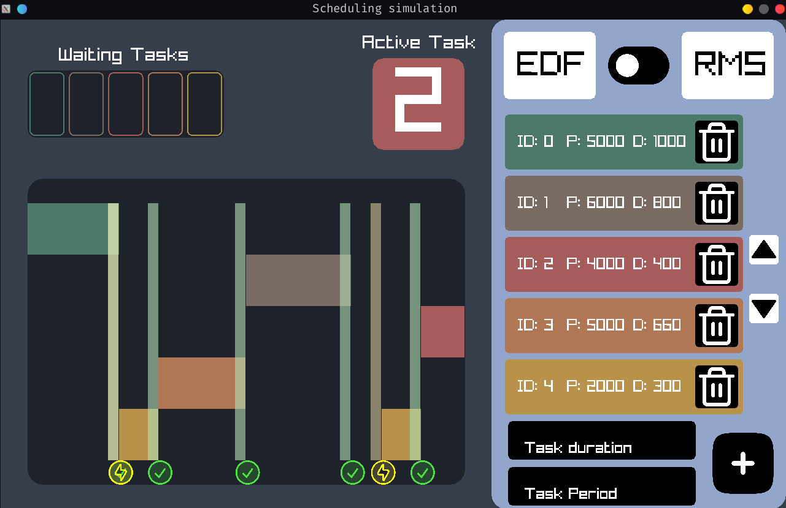
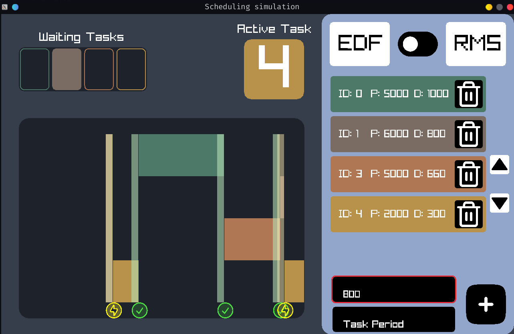

# Real-Time Scheduler Simulation

  

This a multithreaded scheduling simulation implementing event queues, conditional variables, and immediate GUI rendering. It is also my foray of sorts into modern C++ and i think it shows, some of the tuples and ranges. Throughout the project, I aimed to combine my OS course, scheduling and synchronization,and modern C++ concepts. The app logic is split into two main threads: rending and scheduling. Scheduling is done via std::chrono timers and conditional variables where the scheduler waits until an event to runs its logic, pick a new runner, pushes events to the GUI, and sleep for the next event. The rendering thread displays a dynamic Gantt chart. It also can delete/add tasks which wakes up the scheduling threads.

# Demo

<video src="https://github.com/user-attachments/assets/08dcbb25-769a-4921-875d-3213f09a4e00" controls="controls" style="max-width:100%;"> </video>

## Features
1. **Dynamic task editing** \
    On the fly task insertion/ deletion.
2. **Scheduling Algorithm Change** \
    Allow switching between earliest deadline first (EDF) and rate monotonic scheduling RMS
3. **Efficient sleeping** \
    This is achieved through conditional variables and wait_until
4. **Procducer consumer multithreading** \
    the two threads use non-blocking queues to stage and handle changes correctly

##  Architecture

1. **view.cpp** \
    handles the Gnatt chart, the waiting tasks tray, and the current running task.
2. **controls** \
    renders the UI section and handles input events. 
3. **scheduler.cpp** \
    the scheduler 
4. **app.cpp** \
    combine the different components and bind interfaces for communication
5. **main.cpp** \
    the entry point 
### Compiling

the project assumes you have Raylib on the system and require C++20. If you don't just uncomment the fetch content lines in the CMakeLists.txt.

